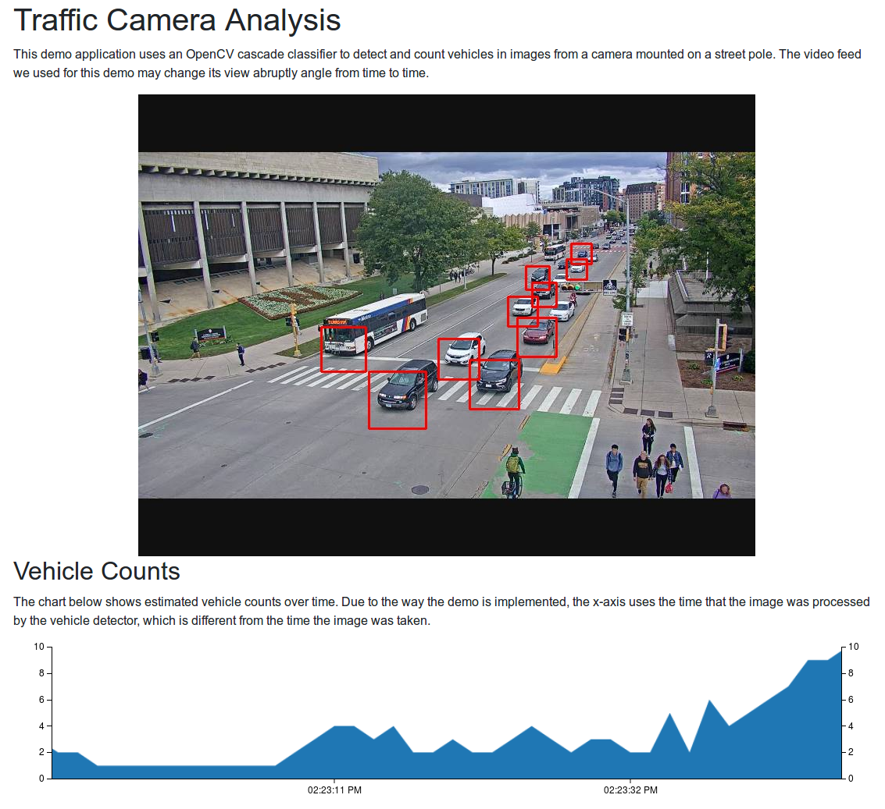

Paradrop Traffic Camera
=======================

This demo chute uses an OpenCV cascade classifier to detect and count
vehicles in images from a camera mounted on a street pole.

Requirements
------------

The default configuration of this chute requires the Paradrop node to
have the **paradrop-imserve** module installed. This is because it pulls
images from a virtual camera (a web server that provides a different
frame with each request). If you are using this chute for a tutorial,
it is likely we installed paradrop-imserve for you. Otherwise, you will
need to install **paradrop-imserve** or change the **IMAGE\_SOURCE\_URL**
environment variable to point to a real camera.

To install **paradrop-imserve**, connect to the node using SSH and run
the following command.

    snap install paradrop-imserve
